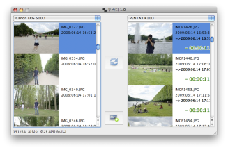
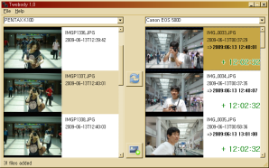
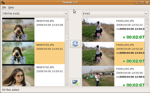

# twobody
Photo management utility that syncs timezone between between 2+ cameras. 
This old code has been imported from the Google Code Archive which has been closed in 2015.

## Screenshots
| OS | Screenshot |
|-|-|
| Mac OS X |  |
| Windows XP |  |
| Linux |  |
